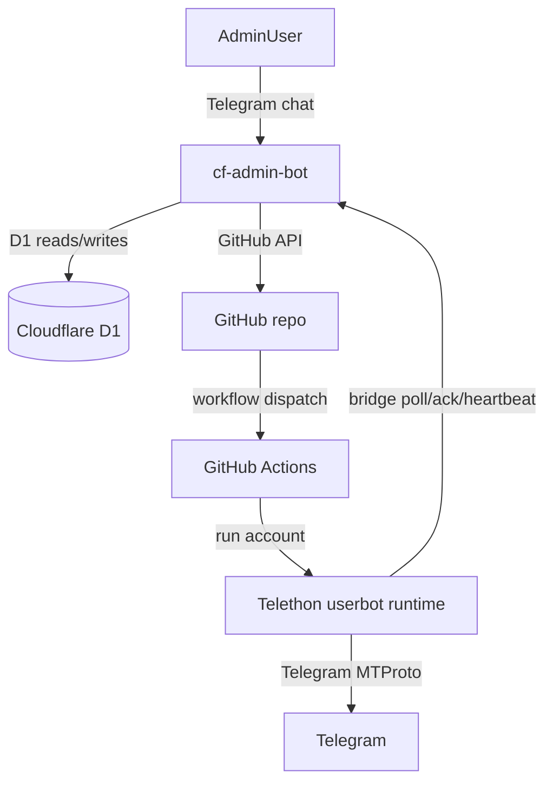

# System Overview

`telegram-auto` یک سیستم دو بخشی است:

1. یک runtime اصلی Python/Telethon که روی اکانت‌های واقعی تلگرام اجرا می‌شود.
2. یک control plane روی Cloudflare Workers به نام `cf-admin-bot` که از طریق تلگرام، GitHub Actions و D1 این اکانت‌ها را مدیریت می‌کند.

## Big Picture

## Main Subsystems

### 1. Userbot runtime
- entrypoint اصلی: `main.py`
- ماژول‌ها در `modules/`
- لایه runtime/config در `app/`
- state هر اکانت در `data/<account>/`

این بخش کار واقعی را انجام می‌دهد: فوروارد، پرومو، discovery، admin DM commands و heartbeat.

### 2. Admin control plane
- entrypoint: `cf-admin-bot/src/entry.py`
- webhook تلگرام: `cf-admin-bot/src/app/Http/Controllers/WebhookController.py`
- منوها و wizardها: controllerهای `cf-admin-bot/src/app/Http/Controllers/`

این بخش UI و orchestration را بر عهده دارد: افزودن اکانت، login، patch کردن profileها، dispatch workflowها، live commands و مشاهده وضعیت.

### 3. GitHub Actions execution plane
- workflowهای reusable و per-account در `.github/workflows/`
- login روی runner IP
- اجرای طولانی‌مدت userbotها
- کارهای pool/cache/linkdir

GitHub Actions عملا لایه اجرای ابری پروژه است.

### 4. Cloudflare D1 control-plane database
- owner: `cf-admin-bot`
- نگهداری userها، accountها، state wizardها، login sessionها، command queue، heartbeatها، catalog discovery، help guides، forward jobs و assignmentها

### 5. Git-backed profile configuration
- registry اکانت‌ها: `config/accounts.json`
- profile هر اکانت: `config/accounts/<id>.json`
- base config مشترک: `config/modules.json`

این فایل‌ها از سمت admin bot با GitHub API patch می‌شوند و source of truth رفتار هر اکانت هستند.

## Runtime Boundaries

## Worker side
- request/response کوتاه
- state دائمی در D1
- مناسب orchestration و admin UI
- مناسب session زنده Telethon نیست

## Telethon side
- اتصال طولانی‌مدت به تلگرام
- module execution
- queue processing
- live command polling

## Why The Split Exists

- Cloudflare Worker برای connection طولانی Telethon مناسب نیست.
- GitHub Actions برای login و اجرای session روی runner IP مناسب‌تر است.
- D1 باعث می‌شود state مدیریتی خارج از runner و خارج از local machine نگهداری شود.

## Core Flows

### Add account
Admin chat → `AccountsController` → `AccountScaffoldService` → GitHub repo files → `login-account.yml` → D1 + session secret

### Edit feature config
Admin chat → `PanelController` یا `ForwardController` → `ProfileConfigService` → GitHub profile patch → restart/dispatch if needed

### Live command
Admin chat → `CommandController` → D1 `commands` → userbot polls `/internal/commands/poll` → executes → ack + heartbeat

### Smart assignment
Admin chat → `AssignmentController` → `AssignmentService` → `RuleEngine` → winning account → profile patch → D1 `assignments` → workflow dispatch

## Read Next

- [`component-map.md`](component-map.md)
- [`../configuration/config-sources.md`](../configuration/config-sources.md)
- [`../cf-admin-bot/request-flows.md`](../cf-admin-bot/request-flows.md)
