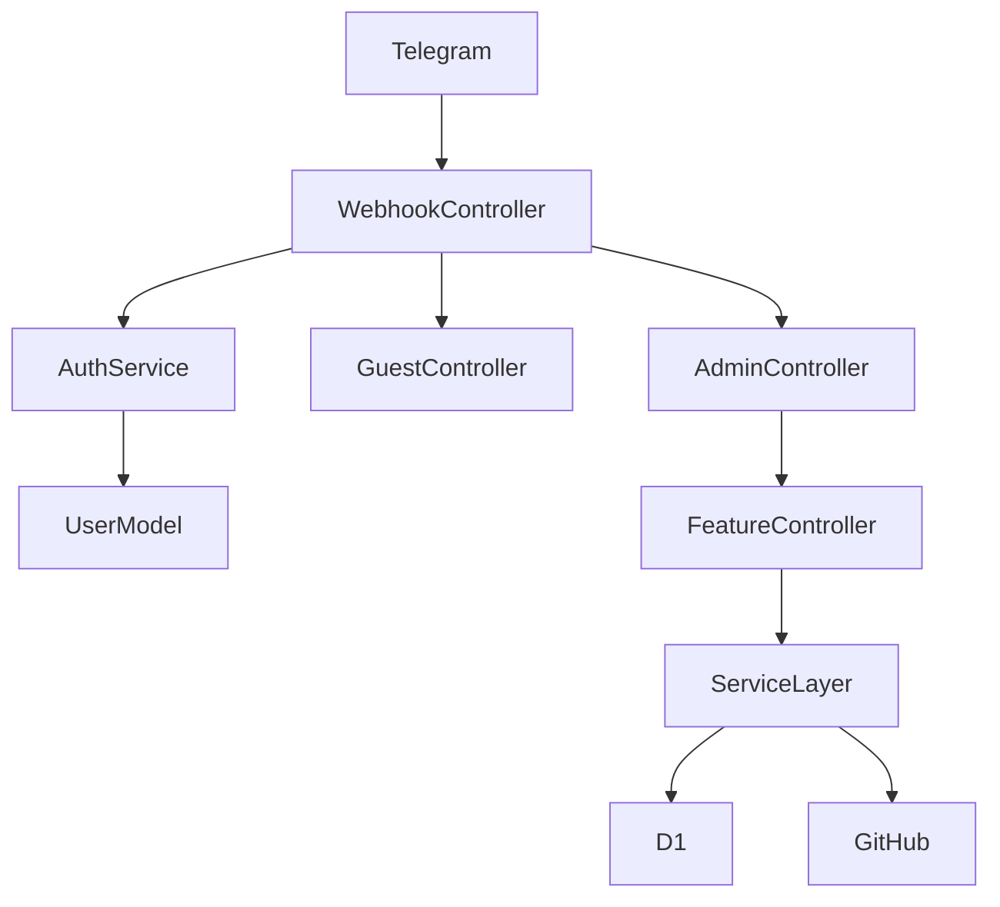

# `cf-admin-bot` Request Flows

این فایل جریان‌های اصلی request و orchestration را خلاصه می‌کند.

## 1. Telegram Webhook

### Steps

1. Telegram به `POST /webhook` request می‌زند.
2. `WebhookController` مقدار `X-Telegram-Bot-Api-Secret-Token` را validate می‌کند.
3. کاربر از طریق `AuthService` resolve/upsert می‌شود.
4. اگر پیام برابر `ADMIN_PASSWORD` باشد، کاربر می‌تواند admin شود.
5. اگر user عادی باشد → `GuestController`
6. اگر admin باشد → `AdminController.dispatch_text()`

## 2. Admin Menu Flow

`AdminController` router اصلی پیام‌های admin است.

ترتیب کلی:
- state فعال را از `UserState` می‌خواند
- wizardهای در حال اجرا را اولویت می‌دهد
- controllerهای feature را به‌ترتیب امتحان می‌کند
- اگر هیچ‌کدام consume نکنند، به منوی اصلی یا unknown fallback می‌رود

feature controllerهای مهم:
- `AccountsController`
- `OpsController`
- `PanelController`
- `ForwardController`
- `CommandController`
- `AssignmentController`
- `HelpController`

## 3. Account Add / Login

1. admin در چت وارد wizard اکانت می‌شود.
2. `AccountsController` داده‌ها را جمع می‌کند.
3. `LoginOrchestratorService` session login را در D1 ثبت می‌کند.
4. `AccountScaffoldService` فایل‌های registry/profile/workflow را در GitHub می‌سازد یا patch می‌کند.
5. `login-account.yml` dispatch می‌شود.
6. workflow اطلاعات OTP/2FA را از bridge یا secretهای موقت می‌گیرد.
7. نتیجه دوباره به admin نشان داده می‌شود.

## 4. Profile Mutation

این مسیر برای forward/promo/discovery settings زیاد استفاده می‌شود:

1. admin از منو تنظیمی را انتخاب می‌کند.
2. controller مربوطه input را validate می‌کند.
3. `ProfileConfigService` ownership و module compatibility را چک می‌کند.
4. profile در GitHub patch می‌شود.
5. در صورت نیاز workflow dispatch یا restart می‌شود.

## 5. Live Commands

1. admin از `CommandController` یک command می‌فرستد.
2. command در جدول `commands` ذخیره می‌شود.
3. userbotهای در حال اجرا endpoint poll را صدا می‌زنند.
4. command را ack و اجرا می‌کنند.
5. نتیجه و heartbeat دوباره به Worker برمی‌گردد.

endpointهای اصلی:
- `GET /internal/commands/poll`
- `POST /internal/commands/ack`
- `POST /internal/commands/enqueue`
- `GET /internal/commands/status`
- `POST /internal/commands/heartbeat`

## 6. Smart Assignment

1. admin route جدید forward یا promo می‌دهد.
2. `AssignmentController` preview می‌سازد.
3. `AssignmentService` لیست accountها، heartbeatها و assignmentهای قبلی را جمع می‌کند.
4. `RuleEngine` accountها را rank می‌کند.
5. برنده انتخاب می‌شود.
6. `ProfileConfigService` route را روی profile اکانت patch می‌کند.
7. `assignments` در D1 ثبت می‌شود.
8. در صورت نیاز workflow dispatch می‌شود.

## 7. Internal Report Flows

GitHub Actions و runtimeها نتیجه کارهای غیرهمزمان را به endpointهای داخلی report می‌کنند:

- login bridge
- pool admin report
- cache admin report
- alerts
- command ack / heartbeat
- linkdir collector heartbeat/report

این endpointها معمولا با `BRIDGE_TOKEN` محافظت می‌شوند.
